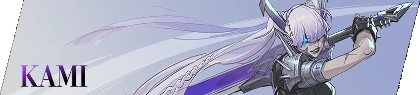
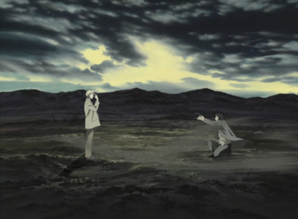
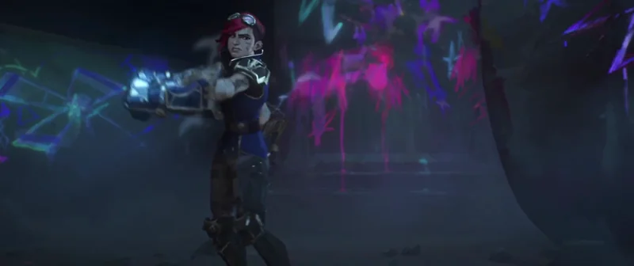
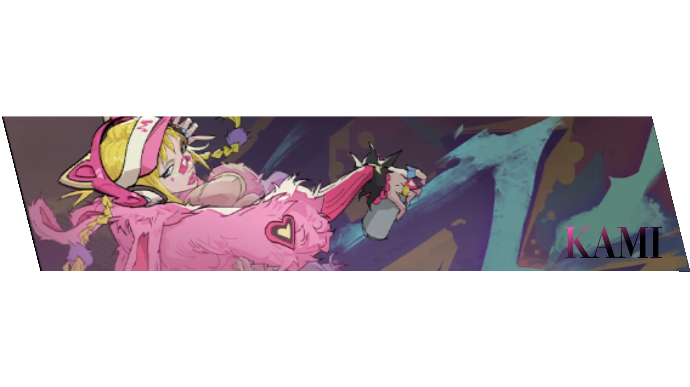

  

<!-- ═══════════ ROW 1: GIF + Quote | About Me ═══════════ -->

<table>
  <tr>
    <td width="50%" align="center" valign="top">
       
      
        
      
       
      <em>— Johan Liebert, Monster</em>
    </td>
    <td width="50%" valign="top">
      <h2 align="center"></h2>
      

        Hi I'm Jay Jay! I'm a 3rd year software engineering student in Immersive Software Engineering (ISE) with a vast interest in coding, mainly on the entrepreneural side.
      

      <h3>Currently:</h3>
      <ul>
        <li>💼 On internship at <strong>Transact Campus</strong></li>
        <li>🏠 Building <strong><a href="https://rentilia.ie">rentilia</a></strong></li>
        <li>🎓 Working on my <strong><a href="https://fyp-mu-nine.vercel.app/">FYP</a></strong></li>
        <li>🇩🇪 Fun fact: <strong>I can say the alphabet in German</strong></li>
      </ul>
    </td>
  </tr>
</table>

  

<!-- ═══════════ ROW 2: Tech Stack | GIF + Quote ═══════════ -->

<table>
  <tr>
    <td width="50%" valign="top">
      <h2 align="center"></h2>
      

        
        
        
        
        
        
        
        
        
        
      

    </td>
    <td width="50%" align="center" valign="top">
       
      
        
      
       
      <em>— Tooru Oikawa, Haikyuu!!</em>
    </td>
  </tr>
</table>

  

<!-- ═══════════ ROW 3: GIF + Quote | Current Projects ═══════════ -->

<table>
  <tr>
    <td width="50%" align="center" valign="top">
       
      
        
      
       
      <em>— Jinx, Arcane</em>
    </td>
    <td width="50%" valign="top">
      <h2 align="center"></h2>
      <ul>
        <li>🎬 <strong>Mean Girls</strong></li>
        <li>🎮 <strong>Elden Ring</strong></li>
        <li>🎵 <strong>Taylor Swift / Bohemian Rhapsody</strong></li>
        <li>🍥 <strong>Monster</strong></li>
      </ul>
    </td>
  </tr>
</table>

  

<!-- ═══════════ ROW 4: Contact | GIF + Quote ═══════════ -->

<table>
  <tr>
    <td width="50%" valign="top">
      <h2 align="center"></h2>
      

        
        
        
        
      

    </td>
    <td width="50%" align="center" valign="top">
       
      
        
      
       
      <em>— Malenia, Elden Ring</em>
    </td>
  </tr>
</table>

  

<!-- ═══════════ ROW 5: GIF + Quote | GitHub Stats ═══════════ -->

<table>
  <tr>
    <td width="50%" align="center" valign="middle">
      
        
      
       
      <em>— Makima, Chainsaw Man</em>
    </td>
    <td width="50%" align="center" valign="top">
      <h2 align="center"></h2>
      
        
      
    </td>
  </tr>
</table>

  

